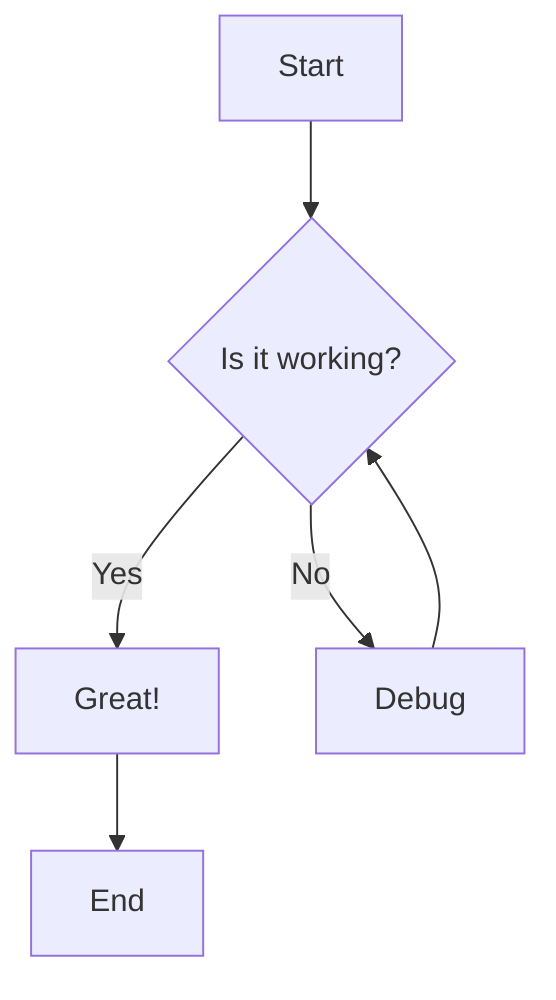
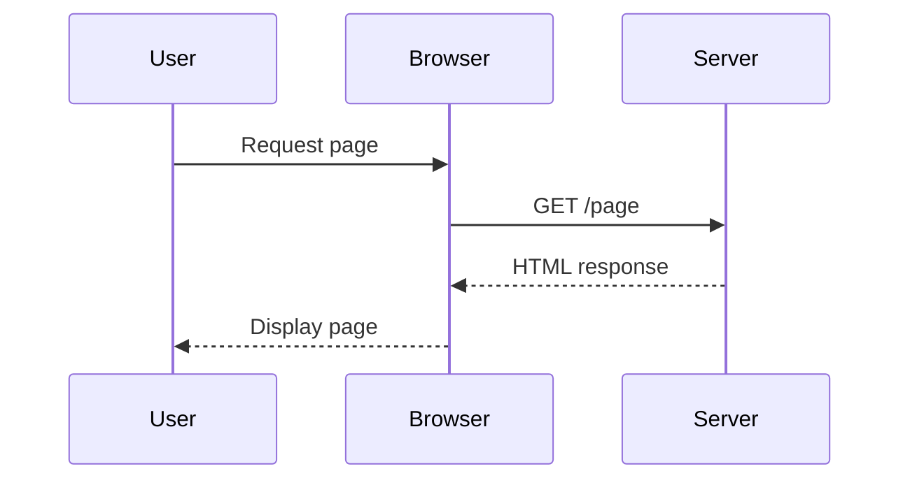
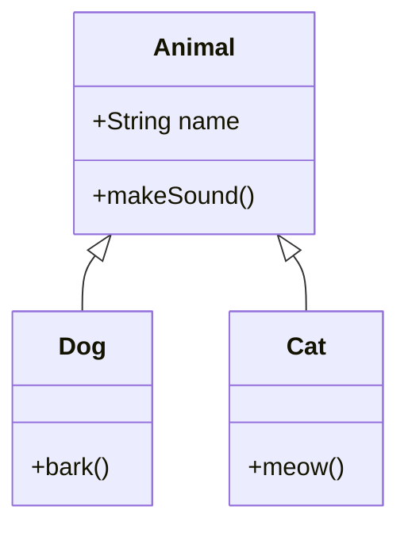
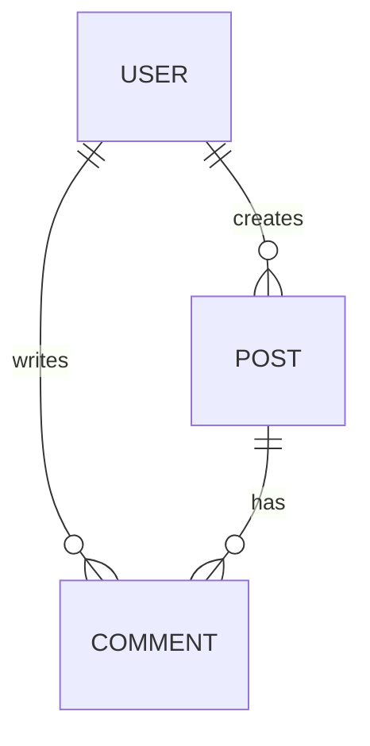
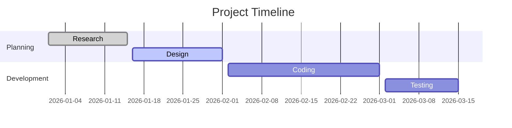
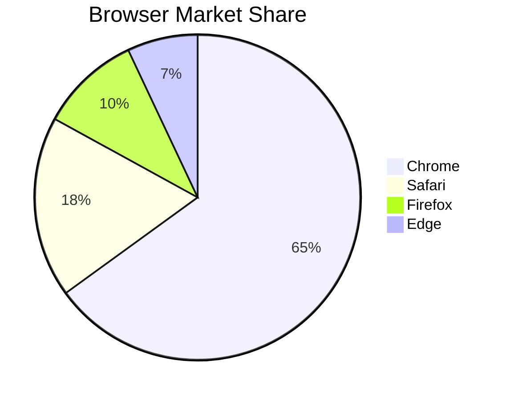
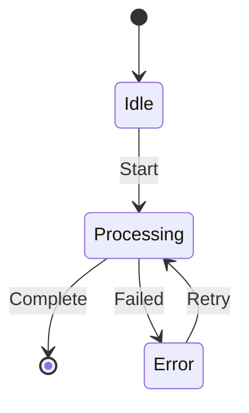

This is a test post to verify Mermaid diagram support.

## Flowchart (Graph TD)

```text
graph TD
    A[Start] --> B{Is it working?}
    B -->|Yes| C[Great!]
    B -->|No| D[Debug]
    D --> B
    C --> E[End]
```



## Sequence Diagram

```text
sequenceDiagram
    participant User
    participant Browser
    participant Server
    
    User->>Browser: Request page
    Browser->>Server: GET /page
    Server-->>Browser: HTML response
    Browser-->>User: Display page
```



## Class Diagram

```text
classDiagram
    class Animal {
        +String name
        +makeSound()
    }
    class Dog {
        +bark()
    }
    class Cat {
        +meow()
    }
    Animal <|-- Dog
    Animal <|-- Cat
```



## Entity Relationship Diagram

```text
erDiagram
    USER ||--o{ POST : creates
    USER ||--o{ COMMENT : writes
    POST ||--o{ COMMENT : has
```



## Gantt Chart

```text
gantt
    title Project Timeline
    dateFormat  YYYY-MM-DD
    section Planning
    Research       :done,    des1, 2026-01-01, 2026-01-15
    Design         :active,  des2, 2026-01-16, 2026-02-01
    section Development
    Coding         :         des3, 2026-02-02, 2026-03-01
    Testing        :         des4, 2026-03-02, 2026-03-15
```



## Pie Chart

```text
pie
    title Browser Market Share
    "Chrome" : 65
    "Safari" : 18
    "Firefox" : 10
    "Edge" : 7
```



## State Diagram

```text
stateDiagram-v2
    [*] --> Idle
    Idle --> Processing : Start
    Processing --> [*] : Complete
    Processing --> Error : Failed
    Error --> Processing : Retry
```



---

If you can see all the diagrams rendered above, Mermaid support is working correctly!