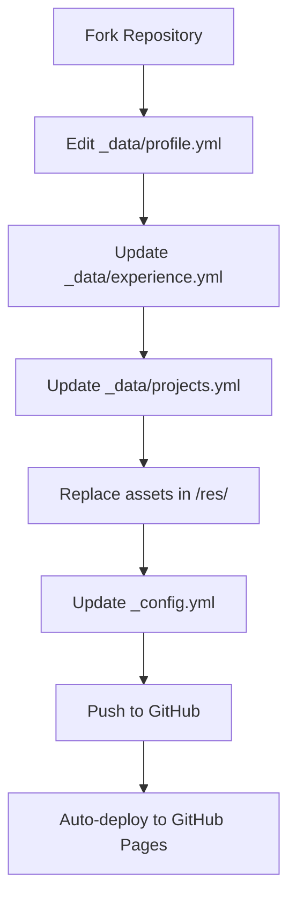

Yeah, it is!

## How It Works

All personal content is stored in structured YAML files under the `_data/` directory. This means you don't need to dig through HTML to update your information, just edit the data files!

```
_data/
├── profile.yml      # Personal info, socials, contact form
├── experience.yml   # Work history & education
├── projects.yml     # Projects showcase
└── techstack.yml    # Skills & hobbies
```

## Customization Flow

Here's how the customization process works:



## What You Can Customize

| File | What to Edit |
|------|--------------|
| `profile.yml` | Name, location, hero text, about me, social links, contact form settings, resume PDF path |
| `experience.yml` | Job positions, companies, dates, responsibilities, tech stack |
| `projects.yml` | Project names, descriptions, tech stack, URLs, visibility |
| `techstack.yml` | Skills categories, hobbies (max 4), icons |

## Quick Start

1. **Fork** this repository to your GitHub account
2. **Edit** the `_data/` YAML files with your information
3. **Replace** assets in `/res/` (profile photo, resume PDF)
4. **Update** `_config.yml` with your domain
5. **Push** changes—GitHub Pages auto-deploys!

## Advanced Customization

For deeper changes, you can also modify:

- **Styling**: Edit `/res/style.css` CSS variables for theme colors
- **Components**: Edit files in `_includes/` for reusable sections
- **Layouts**: Modify `_layouts/` for page structure changes

## Blog Posts with Mermaid Support

The portfolio also supports **Mermaid diagrams** in blog posts (like this one!). Perfect for technical writing and documentation.

Feel free to explore the [repository](https://github.com/0xb01/0xb01.github.io) and make it your own!