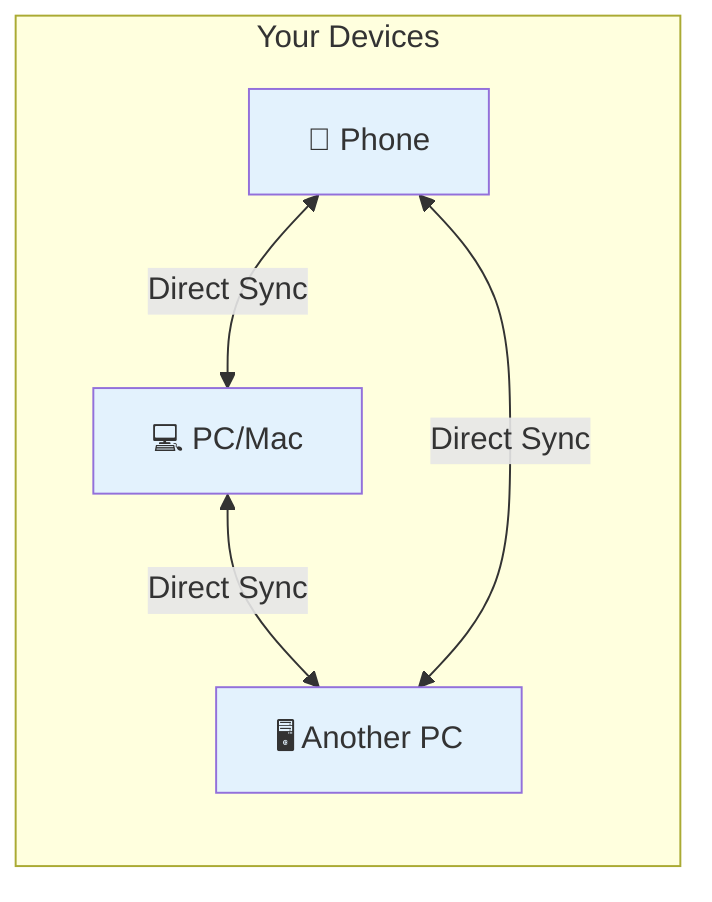
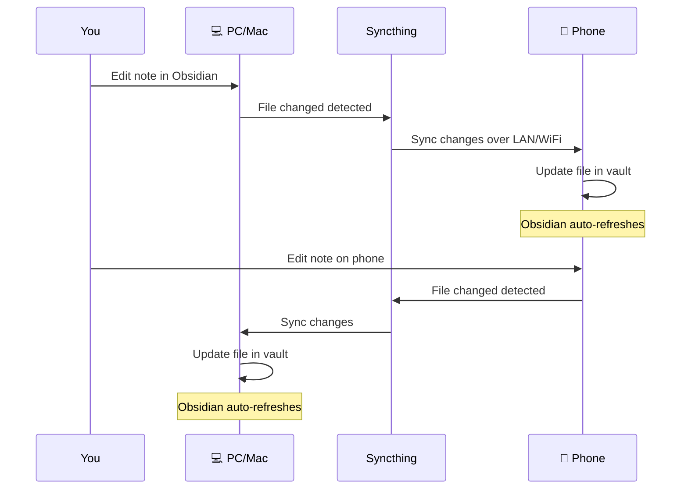

For years, I've been using **Google Keep** for my notes. You know the ones — quick reminders, shopping lists, random thoughts at 2 AM. It's simple, fast, and just works. If you're like me, you probably have hundreds of notes sitting there.

But here's the thing: this is just my opinion, and it might not be yours. Google Keep is great for quick notes, but I started feeling limited. I wanted more control over my notes, better organization, and the ability to link ideas together. That's when I discovered **Obsidian**.

The only problem? Obsidian doesn't have built-in sync for free. That's where **Syncthing** comes in.

## Why I Moved Away from Google Keep

Look, Google Keep is solid. It's everywhere — your phone, your browser, even your smartwatch. You can throw in text, photos, voice notes, and it all syncs instantly. For casual note-taking, it's hard to beat.

But I ran into a few issues:

- **No folders or organization** — everything is just labels and colors
- **Limited formatting** — can't do much beyond basic text
- **Locked into Google** — exporting is possible, but it's not your data really
- **No linking between notes** — great for isolated notes, not for connected thinking

Again, this is just my experience. If Google Keep works for you, stick with it! But if you're feeling the same way I did, keep reading.

## Enter Obsidian + Syncthing

Obsidian treats your notes as plain text files (Markdown), stored in a folder called a "vault". This means you own your data completely. No proprietary formats, no lock-in.

The catch? Obsidian's official sync service costs money. But we can sync for free using **Syncthing**.

## What is Syncthing?

Syncthing is a free, open-source tool that syncs files between your devices directly. No cloud storage, no middleman. Your data stays on your devices only.

Think of it like your own private sync service.

## How It Works

Here's what happens when you set up Syncthing:

All your devices talk directly to each other. When you edit a note on your phone, it syncs to your PC and any other devices automatically.

## Step 1: Install Syncthing

### On PC (Windows/Linux)

1. Go to [syncthing.net](https://syncthing.net/)
2. Download **Syncthing for Windows**
3. Run the installer
4. It will open in your browser at `http://127.0.0.1:8384`

### On Mac

1. Open **Terminal**
2. Run: `brew install syncthing`
3. Run: `syncthing`
4. Or download the app from [syncthing.net](https://syncthing.net/)

### On Android

1. Open Google Play Store
2. Search for **Syncthing-Fork** (recommended)
3. Install it

### On iPhone (iOS)

1. Open App Store
2. Search for **Möbius Sync** (Syncthing client for iOS)
3. Install it

> **Note:** iOS requires the app to stay open for syncing. Keep it running in the foreground.

## Step 2: Connect Your Devices

Each device has a unique **Device ID**. You need to exchange these IDs to connect them.

### On Your PC/Mac (Main Device)

1. Open Syncthing in your browser
2. Click **Actions** → **Show ID**
3. You'll see a QR code and a long ID string
4. Keep this screen open

### On Your Phone

1. Open Syncthing app
2. Tap **Add device** or the **+** button
3. Either:
   - Scan the QR code from your PC, or
   - Type/paste the Device ID manually
4. Give it a name (e.g., "My PC")
5. Tap **Save**

### Back on Your PC/Mac

1. You'll see a notification: "New device wants to connect"
2. Click **Add Device**
3. Give your phone a name (e.g., "My Phone")
4. Click **Save**

Now your devices are paired! But they're not syncing anything yet.

## Step 3: Set Up Your Obsidian Folder

### On Your PC/Mac

1. In Syncthing, click **Add Folder**
2. Choose a folder label (e.g., "Obsidian Vault")
3. Set the **Path** to where you want your vault stored
4. Under **Sharing**, select your phone/other devices
5. Click **Save**

Your vault folder is now ready to sync.

### On Your Phone

1. You'll get a notification: "New folder shared"
2. Tap the notification
3. Choose where to store the folder on your phone
4. Tap **Save**

## Step 4: Open the Vault in Obsidian

### On PC/Mac

1. Open Obsidian
2. Click **Open folder as vault**
3. Select the Syncthing folder you just created
4. Done!

### On Phone

1. Open Obsidian mobile app
2. Tap **Open folder**
3. Navigate to the Syncthing folder
4. Select it as your vault

## Full Sync Flow

Here's the complete picture of how your notes sync:

## Tips for Smooth Syncing

| Tip | Why It Helps |
|-----|--------------|
| Keep devices on the same WiFi | Faster sync, no data usage |
| Enable "Send & Receive" on all devices | Two-way sync works properly |
| Don't edit the same note on two devices at once | Can cause conflicts |
| Check Syncthing status regularly | Make sure all devices are connected |

## Troubleshooting

### Devices Not Connecting

- Make sure both devices are on the same network
- Check firewall settings (allow Syncthing)
- Try adding devices manually with Device ID

### Sync Is Slow

- Initial sync takes time for large vaults
- Move devices closer to WiFi router
- Enable "Local Discovery" in Syncthing settings

### File Conflicts

If you edit the same note on two devices at the same time, Syncthing creates a conflict file (like `note.sync-conflict-20260330.md`). Just merge the changes manually and delete the conflict file.

## Why This Is Better Than Google Keep

| Feature | Google Keep | Obsidian + Syncthing |
|---------|-------------|---------------------|
| Cost | Free | Free |
| Formatting | Basic text only | Full Markdown support |
| Organization | Labels and colors | Folders, links, tags |
| Sync | Google cloud | Your devices directly |
| Data ownership | Google servers | Your files, your control |
| Linking notes | ❌ No | ✅ Yes (backlinks!) |
| Offline access | Limited | Full offline support |

Again, this is just my opinion. Google Keep might be perfect for you. But if you want more control and flexibility, this combo is worth trying.

## Plugins I Use

Obsidian has a ton of community plugins that make it even better. Here are the ones I use daily:

### From Community Plugins

Go to **Settings** → **Community plugins** → **Browse** and search for these:

| Plugin | What It Does |
|--------|--------------|
| **Excalidraw** | Draw diagrams, sketches, and whiteboards directly in your notes. Great for visual thinkers! |
| **Numerals** | Add numbered lists with custom formats. Perfect for structured documents. |
| **Paste URL into selection** | Paste a URL into selected text to turn it into a link automatically. Saves so much time! |

To install:
1. Open Obsidian **Settings**
2. Go to **Community plugins**
3. Turn off "Restricted mode" if it's on
4. Click **Browse**
5. Search for the plugin name
6. Click **Install**, then **Enable**

### My Own Plugin: Zzzzz

I also built a plugin called **Zzzzz** — it helps you find and fix problematic files in your vault (like broken links, large files, or orphaned notes).

> **Note:** Zzzzz is **not** in the Community plugins store yet. You'll need to install it manually from my repo:
>
> 1. Go to [github.com/0xb01/zzzzz](https://github.com/0xb01/zzzzz)
> 2. Download the latest release
> 3. Extract it into your vault's `.obsidian/plugins/` folder
> 4. Enable it in **Settings** → **Community plugins** → **Installed plugins**

## Final Thoughts

I still use Google Keep for quick stuff — shopping lists, random reminders, things I need to grab fast. But for anything that needs real thought or organization, I use Obsidian with Syncthing.

Syncthing takes a bit of setup (maybe 10-15 minutes), but once it's running, you won't notice any difference from paid sync services. Your notes stay in sync, your wallet stays happy, and your data stays private.

Give it a try! Your future self will thank you.
