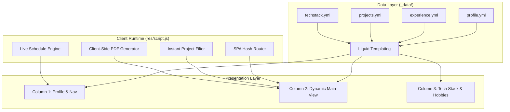

Every few years, developer portfolios tend to accumulate digital dust. What starts as a simple list of projects gradually turns into a patchwork of conflicting CSS rules, rigid layouts, and outdated dependencies.

I recently decided to give my personal portfolio and engineering hub ([banikaz.online](https://banikaz.online)) a complete ground-up redesign. The goal was simple: **build a blazing-fast, terminal-inspired engineering workspace with zero bloat, true OLED dark mode, and seamless mobile ergonomics.**

Here is an architectural breakdown of what changed, how it was built, and the lessons learned along the way.

---

## 1. The Design Philosophy: "Option A" Engineering Terminal

Most modern portfolio templates lean heavily into generic tropes: purple glow on dark slate backgrounds, cluttered bento boxes, and heavy JavaScript frameworks for what is essentially static content.

For this revamp, I wanted an interface that feels like an engineer's native desktop environment:
- **True OLED Pitch Black (`#000000`)**: Deep contrast with zinc borders (`rgba(255, 255, 255, 0.12)`) and clean emerald/cyan terminal accents.
- **Monospace Typography**: Pairings of **Inter** for comfortable prose reading and **JetBrains Mono** for code, tags, and telemetry data.
- **Modular 3-Column Desktop Grid**:
  - **Left Column**: Personal identity, live availability pill, quick navigation, and instant-copy contact badges.
  - **Center Column**: Dynamic content stream (Overview, Timeline, Project Search, Journal, and Resume).
  - **Right Column**: Clickable technical skill chips, categorized tools, and personal hobbies.



---

## 2. Dynamic Client-Side Hash Router

Rather than reloading entire HTML documents on every navigation click, the new architecture uses a lightweight, dependency-free **SPA Hash Router** in vanilla JavaScript.

### Deep Link Permalinks & Direct URL Sync
The router parses the hash fragment to activate views without losing browser history:
- `#home` ➔ System overview & biography
- `#experience` ➔ Interactive career timeline with collapsible cards
- `#projects` ➔ Live search and filtered grid
- `#blog` ➔ Writing journal
- `#post:<url>` ➔ Inlines full markdown articles and renders dynamic Mermaid diagrams
- `#resume` ➔ Full-screen single-column reading view

When viewing articles or the full resume, the layout automatically transforms—hiding auxiliary sidebars and maximizing reading width.

---

## 3. Real-Time Daily Schedule & Timezone Engine

Instead of a static "Online/Offline" indicator, the sidebar now features a live routine evaluator linked to Philippine Standard Time (`Asia/Manila`, UTC+08:00).

The schedule is completely defined in YAML:

```yaml
schedule_config:
  timezone: Asia/Manila
  schedule:
    - start: "08:00"
      end: "11:30"
      status: "Working"
      emoji: "💻"
      type: "working"
    - start: "11:30"
      end: "12:30"
      status: "Lunch"
      emoji: "🍲"
      type: "lunch"
    - start: "18:00"
      end: "22:00"
      status: "Relaxing"
      emoji: "🎮"
      type: "relax"
    - start: "22:00"
      end: "05:00"
      status: "Sleeping"
      emoji: "😴"
      type: "sleep"
```

Every 30 seconds, client-side JavaScript converts current time to minutes from midnight and updates the **Timezone** badge under Contact with accurate routine emojis and color-coded status pulses. Meanwhile, the top bio badge remains cleanly pinned to **"Open to opportunities"**.

---

## 4. Zero-Dependency Client-Side PDF Generation

Maintaining static uploaded PDF copies of a resume is notorious for falling out of sync with your live portfolio website.

In this revamp, pressing **"Download PDF"** synthesizes a crisp, high-DPI A4 document directly in the browser using dynamic on-demand library loading:

```javascript
async function downloadResumePDF() {
    ToastManager.show('Preparing PDF generator...', 'info', 2000);

    // Dynamically load html2pdf only when clicked
    if (typeof html2pdf === 'undefined') {
        await loadScript('https://cdnjs.cloudflare.com/ajax/libs/html2pdf.js/0.10.1/html2pdf.bundle.min.js');
    }

    const resumeSection = document.getElementById('resumeSection');
    const clone = resumeSection.cloneNode(true);
    clone.querySelector('.resume-top-nav')?.remove();

    const opt = {
        margin: [10, 12, 10, 12],
        filename: 'John_Nichols_Ranara_Resume.pdf',
        html2canvas: { scale: 2, useCORS: true, logging: false },
        jsPDF: { unit: 'mm', format: 'a4', orientation: 'portrait' }
    };

    await html2pdf().set(opt).from(clone).save();
    ToastManager.show('Resume PDF downloaded!', 'success', 3000);
}
```

This guarantees that whenever experience or project details are updated in `_data/`, the downloaded PDF reflects the exact same changes immediately.

---

## 5. Native-Grade Mobile Ergonomics

Desktop three-column interfaces often break down on mobile screens. To solve this, the mobile view was rebuilt with app-like ergonomics:

1. **Sticky Top App Bar**: Displays a mini avatar, brand tag (`Banikaz`), availability indicator, theme switcher, and side drawer toggles.
2. **Slide-in Drawers**: Profile navigation and tech stack drawers slide in smoothly from left and right with backdrop blur.
3. **Fixed Bottom Tab Dock**: A 5-tab dock at the bottom of the screen allows 1-tap switching between Home, Work, Projects, Blog, and Resume.
4. **Responsive Layout Isolation**: Enforced block-level container isolation preventing horizontal bleeding across mobile viewports (e.g. Galaxy S20 Ultra, iPhone 15).

---

## 6. Architectural Breakdown & Feature Comparison

| Capability | Legacy Portfolio | Modern Engineering Revamp (2026) |
| :--- | :--- | :--- |
| **Theme System** | Standard Dark / Light | True Pitch Black OLED (`#000000`) & High-Contrast Light |
| **Routing** | Full page reloads | Instant SPA Hash Router (`#home`, `#projects`, `#blog`, `#resume`) |
| **Resume PDF** | Static committed PDF files | On-Demand Client-Side Synthesis (`html2pdf.js`) |
| **Schedule / Time** | Static text label | Live 30s Manila Activity Engine (`Asia/Manila` UTC+8) |
| **Code Snippets** | Raw code blocks | Language Badges + 1-Click Copy + Toast Notifications |
| **Long-Form Reading** | Plain typography | Reading Time Byline + Top Scroll Progress Bar + Dynamic TOC |
| **Diagrams & Media** | Static images | Full-Resolution Lightbox Zoom + Centered Figures |
| **Data Separation** | Mixed HTML/Markdown | 100% Declarative YAML in `_data/*.yml` |

---

## Key Takeaways

1. **Vanilla is Powerful**: You don't need megabytes of framework runtime to build interactive, stateful single-page experiences.
2. **Data-First Architecture**: Separating 100% of the content into structured `_data/*.yml` files makes ongoing maintenance effortless.
3. **Performance Matters**: Fast page loads and instant tab switching make portfolio exploration a joy rather than a chore.

Feel free to explore the live implementation at [banikaz.online](https://banikaz.online) or check out the open-source code on [GitHub](https://github.com/0xb01).
