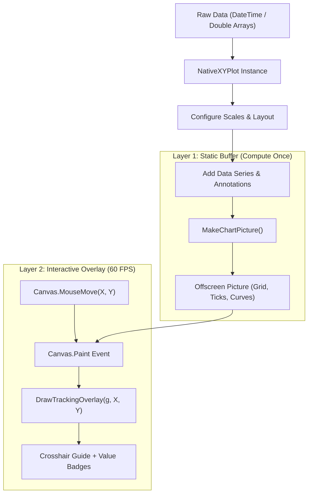

Zero-dependency time-series, telemetry, and digital signal charting with decoupled 60 FPS interactive hover tracking.

---


## Motivation: Zero External Dependencies

Visualizing telemetry, IoT metrics, scientific data, and device states often comes with external baggage. Many charting tools require third-party libraries, binary dependencies, or restrictive licensing terms.

**NativeXYPlot** is a 100% native 2D plotting engine built strictly with Xojo core primitives (`Graphics` and `Picture`). It provides complete control over rendering, smooth canvas interactivity, and clean cross-platform compatibility across Windows, macOS, and Linux.

---

## Core Architecture: Decoupled 60 FPS Interaction

Redrawing complex line charts with thousands of data points on every mouse movement causes canvas stutter. NativeXYPlot solves this with a two-layer decoupled rendering architecture:



1. **Static Buffer**: Compute curves, grid lines, and axis ticks once into an offscreen `Picture` bitmap via `MakeChartPicture()`.
2. **Interactive Overlay**: When user hovers over canvas, `DrawTrackingOverlay()` draws only vertical guide line, snapped curve points, and leader-line value badges directly onto active `Graphics` context without re-rasterizing background curves.

---

## Key Capabilities

### 1. Multi-Mode X Scaling (Time-Series & Numeric)
- **Time-Series (`DateTime`)**: Automatic Unix epoch conversion and adaptive date formatting (`dd/MM` or `dd/MM HH:mm` based on visible span).
- **Linear Numeric**: Dynamic power-of-10 step calculation with clean round grid numbers.

### 2. Digital Signals & Relay Step-Lines
Plotting binary state transitions (e.g. Pump ON/OFF, valve actuation) with standard linear curves creates misleading diagonal ramps. NativeXYPlot provides dedicated step-curve renderers (`AddStepSeries`, `AddBooleanSeries`, `AddDateBooleanSeries`) and discrete categorical Y labels:

```vb
// Discrete Y-axis (0 = OFF, 1 = ON)
plot.SetYDiscreteLabels(Array("OFF", "ON"), -0.2, 1.2)
plot.SetYTitle("State")

// Add boolean square-wave tracks
plot.AddDateBooleanSeries(timestamps, relay1States, &c3185FC, "Relay 1 (Power)", 2)
plot.AddDateBooleanSeries(timestamps, pumpStates, &cE63946, "Coolant Pump", 2)
```

### 3. Tolerance Bands & Vertical Event Markers
- **Threshold Zones (`AddThreshold`)**: Highlight safe operating bands (e.g. 20°C - 24°C) with background shading and limit lines.
- **Event Markers (`AddMarker`)**: Pinpoint specific maintenance timestamps, threshold breaches, or system alerts with vertical lines and text labels.

---

## Quickstart Example

```vb
// 1. Initialize and layout
Var plot As New NativeXYPlot(Canvas1.Width, Canvas1.Height)
plot.AddTitle("HVAC Temperature Log")
plot.SetPlotArea(60, 45, Canvas1.Width - 120, Canvas1.Height - 80)

// 2. Set scale (epoch seconds)
Var dStart As DateTime = DateTime.Now - New DateInterval(0, 0, 7)
Var dEnd As DateTime = DateTime.Now
plot.SetXDateScale(dStart.SecondsFrom1970, dEnd.SecondsFrom1970)
plot.SetYLinearScale(15.0, 30.0, "°C")

// 3. Add tolerance band & data series
plot.AddThreshold(20.0, 24.0, &cE8F5E9, &c81C784)
plot.AddDateSeries(livingRoomDates, livingRoomTemps, &c3185FC, "Living Room", 2)
plot.AddDateSeries(bedroomDates, bedroomTemps, &cFA9B70, "Bedroom", 2)
plot.AddMarker(maintenanceDate.SecondsFrom1970, "Filter Serviced", &c6A4C93)

// 4. Render to Canvas
Canvas1.Backdrop = plot.MakeChartPicture()
```

---

## Implementing 60 FPS Hover Tracking in Canvas

```vb
// Canvas Properties:
// mPlot As NativeXYPlot
// mBasePicture As Picture
// mMouseX As Integer = -1
// mMouseY As Integer = -1

// In Canvas Data Load / Update:
mBasePicture = mPlot.MakeChartPicture()
Canvas1.Refresh

// In Canvas.MouseMove:
Sub MouseMove(X As Integer, Y As Integer)
  mMouseX = X
  mMouseY = Y
  Self.Refresh // Fast repaint without regenerating base picture
End Sub

// In Canvas.Paint:
Sub Paint(g As Graphics, areas() As Rect)
  If mBasePicture <> Nil Then
    g.DrawPicture(mBasePicture, 0, 0)
  End If
  
  If mPlot <> Nil And mMouseX >= 0 Then
    mPlot.DrawTrackingOverlay(g, mMouseX, mMouseY, True)
  End If
End Sub
```

---

## Repository Structure

```
├── .gitattributes                # LF normalization
├── .gitignore                   # Build & debug artifact ignore rules
├── README.md                    # Project overview & quickstart
├── docs/
│   ├── DOCUMENTATION.md         # Full API & architecture reference
│   ├── BLOGPOST.md              # Project announcement & technical breakdown
│   └── Screenshot.png           # Showcase screenshot
├── src/
│   └── NativeXYPlot.xojo_code   # Core plot engine class
└── demo/
    ├── Sample.xojo_project      # Showcase desktop demo project
    └── ...
```

---

## Summary

NativeXYPlot proves responsive, feature-complete 2D charting achievable in pure Xojo without external dependencies.

- Drop `src/NativeXYPlot.xojo_code` into desktop or web project.
- Open `demo/Sample.xojo_project` to test interactive features.
- See [docs/DOCUMENTATION.md](https://github.com/0xb01/NativeXYPlot/blob/master/docs/DOCUMENTATION.md) for full API reference.
