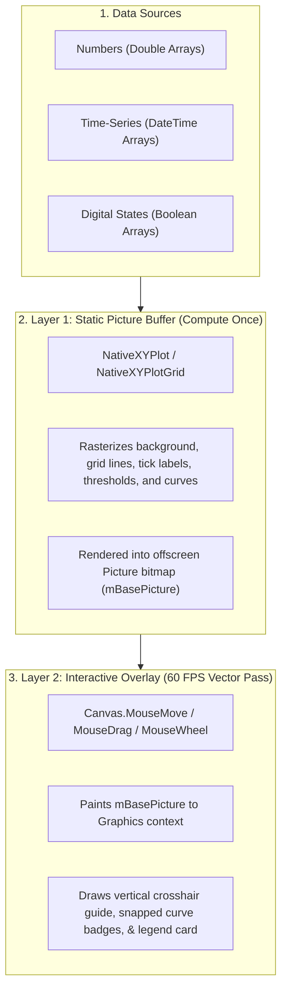

Zero-dependency time-series, telemetry, multi-plot grid matrix layouts, and digital signal charting with decoupled 60 FPS interactive hover tracking and vector PDF export.

---


## Motivation: Zero External Dependencies

Visualizing telemetry, IoT metrics, scientific data, and device states in desktop and web applications often comes with external baggage. Many charting tools require third-party plugins, external C/C++ libraries, or restrictive licensing terms.

**NativeXYPlot** is a 100% native 2D plotting engine and multi-plot grid system built strictly with Xojo core primitives (`Graphics`, `Picture`, and `PDFDocument`). It provides complete control over rendering, smooth canvas interactivity, and clean cross-platform compatibility across macOS, Windows, and Linux.

---

## Core Architecture: Decoupled 2-Layer 60 FPS Rendering

Redrawing complex line charts with thousands of data points on every mouse movement causes canvas stutter. NativeXYPlot solves this with a two-layer decoupled rendering architecture:



1. **Static Picture Buffer (Layer 1)**: All heavy curve math, axis transformations, grid lines, and labels are rendered once into an offscreen `Picture` bitmap via `MakeChartPicture()`.
2. **Interactive Overlay (Layer 2)**: When moving the cursor, panning, or zooming, `DrawTrackingOverlay()` or `DrawTrackingOverlayByValue()` draws only the crosshair guide, snapped curve points, and value badges directly onto the active `Graphics` context without re-rasterizing background curves.

---

## Key Capabilities

### 1. Multi-Mode X Scaling & Auto-Scaling
- **Time-Series (`DateTime`)**: Automatic Unix epoch conversion with adaptive date formatting (`dd/MM` or `dd/MM HH:mm` based on visible span).
- **Linear Numeric**: Dynamic power-of-10 step calculation with clean, rounded grid divisions.
- **Auto-Fit (`AutoScale`, `AutoScaleX`, `AutoScaleY`)**: Automatically fits scale boundaries to active data with configurable margin padding.

### 2. Multi-Plot Grid Matrix (`NativeXYPlotGrid`)
Organize multiple subplots into rows and columns on a single canvas with flexible cell spacing and outer margins:

```
+---------------------------------------------------+
|  NativeXYPlotGrid (e.g. 2 Rows x 2 Columns)       |
|                                                   |
|  [ Cell (0, 0): Plot A ]   [ Cell (0, 1): Plot B ]|
|  (Live Stream Sensor)      (Harmonic Waveform)    |
|                                                   |
|  [ Cell (1, 0): Plot C ]   [ Cell (1, 1): Plot D ]|
|  (IoT Climate 7-Days)      (Digital I/O Tracks)   |
+---------------------------------------------------+
```

- **Independent Zoom & Pan**: Scroll mouse wheel or drag to adjust specific subplots independently.
- **Linked Axes (`LinkAllX`, `LinkColumnX`)**: Synchronize X-axis zooming and scrolling across rows or columns.
- **Synchronized Scrubbing (`SyncCrosshair`)**: Broadcast hover crosshairs across all subplots simultaneously.

### 3. Digital Signals & Categorical Step-Lines
Plotting binary state transitions (e.g., Pump ON/OFF, valve actuation) with standard linear curves creates misleading diagonal slopes. NativeXYPlot provides dedicated step-curve renderers (`AddStepSeries`, `AddBooleanSeries`, `AddDateBooleanSeries`) and discrete categorical Y labels:

```vb
// Discrete Y-axis (0 = OFF, 1 = ON)
plot.SetYDiscreteLabels(Array("OFF", "ON"), -0.2, 1.2)
plot.SetYTitle("State")

// Add boolean square-wave tracks
plot.AddDateBooleanSeries(timestamps, relay1States, &c3185FC, "Relay 1 (Power)", 2)
plot.AddDateBooleanSeries(timestamps, pumpStates, &cE63946, "Coolant Pump", 2)
```

### 4. Tolerance Bands & Event Markers
- **Threshold Zones (`AddThreshold`)**: Highlight safe operating bands (e.g., 20°C – 24°C) with background shading and boundary lines.
- **Event Markers (`AddMarker`)**: Pinpoint specific maintenance timestamps, alerts, or threshold breaches with vertical lines and label badges.

### 5. Vector PDF & High-Res PNG Export
- **Vector PDF (`MakePDFDocument`, `ExportPDF`)**: Generates scalable vector PDF documents using Xojo `PDFDocument`.
- **High-Resolution PNG (`MakeChartPicture(w, h)`)**: Exports crisp offscreen raster images at arbitrary pixel dimensions.

---

## Interactive Demo Showcase

The included demo project (`demo/Sample.xojo_project`) features 6 built-in recipe modes:

| Tab | Demo Mode | Description | Key Features |
| :---: | :--- | :--- | :--- |
| **0** | **IoT Telemetry** | Multi-sensor climate monitoring over a 7-day timeline. | Date axis (`SetXDateScale`), comfort zone shading (`AddThreshold`), milestone markers (`AddMarker`). |
| **1** | **Waveforms** | High-frequency harmonic sine waves & damped cosine decays. | Dual-polarity linear scales (`-10V..+10V`), math functions, multi-series styling. |
| **2** | **Live Feed** | Real-time sensor stream updating on a 250ms interval timer. | Dynamic rolling ring buffer (`mLiveX`, `mLiveY`), auto-scrolling linear scale. |
| **3** | **Digital I/O** | Multi-channel actuator & relay timeline with discrete logic states. | Discrete categorical Y labels (`SetYDiscreteLabels`), stacked boolean digital lanes (`AddDateBooleanSeries`). |
| **4** | **Synced 3-Plot** | 3 stacked subplots linked to a unified time axis. | Synchronized scrubbing cursor (`DrawTrackingOverlayByValue`), linked timeline crosshairs. |
| **5** | **2x2 Multi-Grid** | $2 \times 2$ heterogeneous matrix layout with mixed scales. | Matrix container (`NativeXYPlotGrid`), independent zoom/pan, broadcast crosshair sync. |

### Canvas Interactivity & Keyboard Shortcuts

| Key / Input | Action | Description |
| :---: | :--- | :--- |
| **`P`** | **Toggle Data Point Dots** | Toggles point markers on/off. Switches between clean lines and lines with circular dots at each data point. |
| **`L`** | **Toggle Legend Badge** | Shows or hides floating dark legend summary box during hover tracking. |
| **Mouse Drag** | **Pan Viewport** | Click and drag horizontally to pan/scroll across the data domain. |
| **Mouse Wheel** | **Zoom In / Out** | Scroll mouse wheel to zoom centered at cursor position. |

---

## Code Examples

### 1. Single Plot Quickstart
```vb
// 1. Initialize and layout
Var plot As New NativeXYPlot(Canvas1.Width, Canvas1.Height)
plot.AddTitle("HVAC Temperature Log")
plot.SetPlotArea(60, 45, Canvas1.Width - 120, Canvas1.Height - 80)

// 2. Set scale (epoch seconds)
Var dStart As DateTime = DateTime.Now - New DateInterval(0, 0, 7)
Var dEnd As DateTime = DateTime.Now
plot.SetXDateScale(dStart.SecondsFrom1970, dEnd.SecondsFrom1970)
plot.SetYLinearScale(15.0, 30.0, "°C")

// 3. Add tolerance band & data series
plot.AddThreshold(20.0, 24.0, &cE8F5E9, &c81C784)
plot.AddDateSeries(livingRoomDates, livingRoomTemps, &c3185FC, "Living Room", 2)
plot.AddDateSeries(bedroomDates, bedroomTemps, &cFA9B70, "Bedroom", 2)
plot.AddMarker(maintenanceDate.SecondsFrom1970, "Filter Serviced", &c6A4C93)

// 4. Render to Canvas
Canvas1.Backdrop = plot.MakeChartPicture()
```

---

### 2. Multi-Plot Matrix Setup (`NativeXYPlotGrid`)
```vb
Var grid As New NativeXYPlotGrid(Canvas1.Width, Canvas1.Height, 2, 2)
grid.SetSpacing(45, 30, 38, 38, 25, 30)

// Cell (0, 0): Live Pressure Sensor
Var p00 As NativeXYPlot = grid.Plot(0, 0)
p00.SetXLinearScale(0, 100)
p00.SetYLinearScale(0, 100, " psi")
p00.SetYTitle("Pressure")
p00.AddSeries(xVals, yPress, &c0077B6, "Feed A", 2)

// Cell (0, 1): Voltage Waveform
Var p01 As NativeXYPlot = grid.Plot(0, 1)
p01.SetXLinearScale(0, 100)
p01.SetYLinearScale(-10, 10, " V")
p01.SetYTitle("Voltage")
p01.AddSeries(xVals, yVolt, &c3185FC, "Sine", 2)

// Render:
Canvas1.Backdrop = grid.MakeChartPicture()
```

---

### 3. Wiring 60 FPS Interactivity & Pan/Zoom in Canvas
```vb
// Canvas Properties:
// mGrid As NativeXYPlotGrid
// mBasePicture As Picture
// mMouseX As Integer = -1
// mMouseY As Integer = -1
// mStartX As Integer, mStartY As Integer
// mIsDragging As Boolean
// mActiveHitPlot As NativeXYPlot

// In Canvas.MouseMove:
Sub MouseMove(X As Integer, Y As Integer)
  mMouseX = X
  mMouseY = Y
  Self.Refresh
End Sub

// In Canvas.MouseDown:
Function MouseDown(X As Integer, Y As Integer) As Boolean
  mStartX = X
  mStartY = Y
  mIsDragging = True
  mActiveHitPlot = mGrid.GetPlotAt(X, Y)
  Return True
End Function

// In Canvas.MouseDrag:
Sub MouseDrag(X As Integer, Y As Integer)
  If mIsDragging And mActiveHitPlot <> Nil Then
    Var deltaX As Integer = mStartX - X
    Call mGrid.HandleMouseDrag(deltaX, 0, mActiveHitPlot)
    mStartX = X
    mStartY = Y
    mBasePicture = mGrid.MakeChartPicture()
    Self.Refresh
  End If
End Sub

// In Canvas.MouseWheel:
Function MouseWheel(X As Integer, Y As Integer, deltaX As Integer, deltaY As Integer) As Boolean
  If mGrid.HandleMouseWheel(X, Y, deltaX, deltaY, 1.2) Then
    mBasePicture = mGrid.MakeChartPicture()
    Self.Refresh
    Return True
  End If
  Return False
End Function

// In Canvas.Paint:
Sub Paint(g As Graphics, areas() As Rect)
  If mBasePicture <> Nil Then
    g.DrawPicture(mBasePicture, 0, 0)
  End If
  
  If mGrid <> Nil And mMouseX >= 0 Then
    mGrid.DrawTrackingOverlay(g, mMouseX, mMouseY, True)
  End If
End Sub
```

---

### 4. Real-Time Streaming Ring Buffer (250ms Timer)
```vb
Sub SimTimer_Action()
  mStep = mStep + 1
  Var nowSec As Double = DateTime.Now.SecondsFrom1970
  
  // 1. Append reading to ring buffer
  mBufTime.Add(nowSec)
  mBufPsi.Add(50.0 + Sin(mStep * 0.2) * 15.0 + Rnd * 4.0)
  mBufFlow.Add(120.0 + Cos(mStep * 0.15) * 20.0)
  
  // 2. Retain rolling window (e.g. last 60 points)
  If mBufTime.Count > 60 Then
    mBufTime.RemoveAt(0)
    mBufPsi.RemoveAt(0)
    mBufFlow.RemoveAt(0)
  End If
  
  // 3. Update plot
  Var pLive As NativeXYPlot = mGrid.Plot(0, 0)
  pLive.ClearSeries()
  pLive.AddDateSeries(mBufTime, mBufPsi, &c0077B6, "Pressure", 2)
  pLive.AddDateSeries(mBufTime, mBufFlow, &cF77F00, "Flow", 2)
  pLive.SetXDateScale(mBufTime(0), mBufTime(mBufTime.LastIndex))
  
  // 4. Redraw
  mBasePicture = mGrid.MakeChartPicture(Canvas1.Width, Canvas1.Height)
  Canvas1.Refresh
End Sub
```

---

### 5. Exporting Vector PDF
```vb
Var f As FolderItem = FolderItem.ShowSaveFileDialog(".pdf", "TelemetryReport.pdf")
If f <> Nil Then
  grid.ExportPDF(f, fitPage = True, landscape = True)
End If
```

---

## Repository Structure

```
├── .gitattributes                # LF normalization
├── .gitignore                   # Build & debug artifact ignore rules
├── README.md                    # Project overview & quickstart
├── docs/
│   ├── DOCUMENTATION.md         # Full API & architecture reference
│   └── Screenshot.png           # Showcase screenshot
├── src/
│   ├── NativeXYPlot.xojo_code     # Core single-plot engine class
│   └── NativeXYPlotGrid.xojo_code # Multi-plot matrix container class
└── demo/
    ├── Sample.xojo_project      # Showcase desktop demo project
    ├── NativeXYPlot.xojo_code
    ├── NativeXYPlotGrid.xojo_code
    └── Window1.xojo_window      # Demo UI with segmented tabs & 2x2 grid
```

---

## Summary

NativeXYPlot provides a pure native Xojo charting and matrix layout solution with zero third-party dependencies:

- Drop `src/NativeXYPlot.xojo_code` and `src/NativeXYPlotGrid.xojo_code` into desktop or web projects.
- Explore `demo/Sample.xojo_project` to test the 6 interactive demo modes.
- Refer to [docs/DOCUMENTATION.md](https://github.com/0xb01/NativeXYPlot/blob/master/docs/DOCUMENTATION.md) for full API reference.
